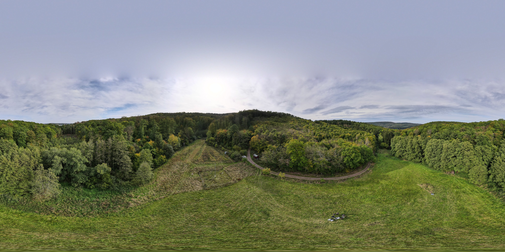

{max-width="100%"}

Marburg Open Forest (MOF) is a teaching and research facility in the university forest. The aim of the project is to create an open and accessible forest area for research and teaching while simultaneously managing and utilising it. The MOF focuses on research into specific ecosystem services of the mixed low mountain forest, the recording of faunistic and floristic biodiversity, sustainable forest management and environmental education. It serves as a living laboratory where scientists can study forest ecosystems, the effects of climate change and conservation techniques.  The MOF seeks to harmonise research, climate change adaptation and public engagement, contributing to both scientific knowledge and awareness-raising.
